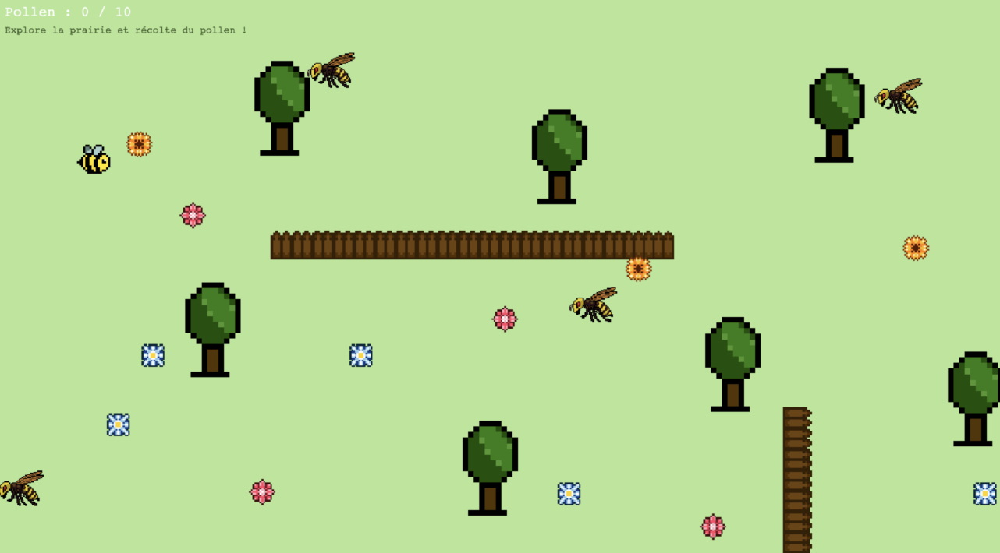

# Au cœur de la ruche

Un jeu de plateforme et de mini-jeux dans lequel on incarne une abeille pour
découvrir les différentes étapes de la fabrication du miel.

**Jouer en ligne (itch.io) :** https://lenaschnkl.itch.io/au-coeur-de-la-ruche

## Description

**Au cœur de la ruche** est un petit jeu en 2D, à la direction artistique pixel
art simple et colorée, qui mêle jeu de plateforme, mini-jeux et découverte
scientifique. Le joueur accompagne une abeille à travers les grandes étapes de
la production du miel, de la récolte du pollen jusqu'au scellage des alvéoles.

Le jeu s'adresse principalement aux enfants : le gameplay est pensé pour être
simple à prendre en main, tout en proposant une progression variée d'un niveau
à l'autre.

### Fonctionnalités

- **5 niveaux** illustrant chacun une étape de la fabrication du miel.
- Un gameplay qui change selon le niveau (exploration libre, vol façon
  « flappy », plateforme avec sauts…).
- Une dimension de **médiation scientifique** : chaque niveau s'appuie sur le
  fonctionnement réel d'une ruche, et les frelons représentent une menace réelle
  pour les abeilles.

## Capture



## Modules et librairies

- **Kaplay 3001.0.19** — moteur de jeu 2D en JavaScript, importé directement via
  le CDN unpkg dans `main.js` :
  ```js
  import kaplay from "https://unpkg.com/kaplay@3001.0.19/dist/kaplay.mjs";
  ```

Aucune installation n'est nécessaire : il suffit d'ouvrir `index.html` dans un
navigateur (de préférence via un petit serveur local, car le projet utilise des
modules ES).

## Copyrights, licence et sources

- **Code :** écrit par Lena Schenkel.
- **Visuels (pixel art) :** intégralement créés par Lena Schenkel sur Pixel Art.

## Recours aux LLM

Un modèle de langage (**ChatGPT, OpenAI**) a été mobilisé sur ce projet aux fins
suivantes :

- **Aide à l'écriture de certaines fonctions :** appui pour structurer ou écrire
  des portions de code en JavaScript / Kaplay.
- **Relecture et correction de bugs :** identification et correction d'erreurs
  dans le code existant.

La conception du jeu, le game design, l'ensemble des visuels (pixel art) et la
structure générale du code restent le travail de Lena Schenkel.

## Crédits

- **Concept et développement :** Lena Schenkel
- **Design visuel (pixel art) :** Lena Schenkel

Projet réalisé dans le cadre du cours **« Jeux vidéo 2D »** à l'Université de
Lausanne, supervisé par Loïc Cattani.
